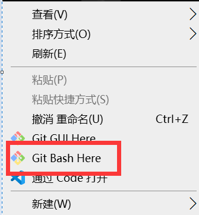

## 起步

### 版本控制简介

### 安装Git

[Git官方下载地址](https://git-scm.com/download)

如果下载慢可以使用这一个地址下载windows版本的[Git for win](https://npm.taobao.org/mirrors/git-for-windows/)

### 初次运行Git需要进行的配置

#### Git的`config`文件的介绍

Git 自带一个 `git config` 的工具来帮助设置控制 Git 外观和行为的配置变量。 这些变量存储在三个不同的位置：

1. `/etc/gitconfig` 文件: 包含==系统上每一个用户及他们仓库的通用配置==。 如果在执行 git config 时带上`--system` 选项，那么它就会读写该文件中的配置变量(由于它是系统配置文件，因此你需要管理员或超级用户权限来修改它)。
2. `~/.gitconfig` 或` ~/.config/git/config` 文件：==只针对当前用户==。你可以传递 `--global`选项让 Git读写此文件, 这会==对你系统上所有的仓库生效==。
3. 当前使用仓库的 Git 目录中的 config 文件(即 `.git/config`): ==针对该仓库==。 你可以传递 --`local`选项让 Git 强制读写此文件，虽然默认情况下用的就是它(当然, 你需要进入某个 Git 仓库中才能让该选项生效)。

如果同时进行了上面这三种级别的配置，则会按照就近原则来生效，也就是3的配置会覆盖2的配置，2的配置会覆盖1的配置。

#### 使用`config`命令来进行Git的用户名和邮箱地址的配置

根据上面的介绍, 我们应该在初次启动Git时就对`/etc/gitconfig`文件或者是`~/.gitconfig`(`~/.config/git/config`)文件进行配置。其中一件必须要做的事情是设置你的用户名以及邮箱地址。这两个信息是必要且十分重要的，因为每一次Git的提交都要用到这些信息，它们会写到我们的每一次提交中不可更改。

也就是说，这个我们配置的用户名以及邮箱地址唯一地标识了我们的身份。配置方式如下：

1. 打开右键打开Git的命令行工具

	

2. 在其中键入如下代码

	```bash
	git config --global user.name "your user name"
	git config --global user.email "your email address"
	```

	- 这里说明以下，这个用户名和邮箱地址只是用于在本地库的提交起作用，用户名和邮箱地址和后面的远程库的用户名和密码没有必要联系，因此邮箱地址甚至可以是一个不存在的地址。
	- 同时以上的命令只需要执行一次，这个信息就可以在你的系统用户中在多个仓库中使用

3. 对于1.3.2中的第三个`config`的配置，需要我们先建立仓库才能进行，因为它只对某一个仓库生效，不是全局的，配置命令如下：

	```bash
	git config [--local] user.name "user name"
	git config [--local] user.email "your email"
	```

	其中方括号[]的内容为可选。也就是默认的不带参数的`config`命令就是只对当前仓库进行配置。

4. 我的配置信息

	```
	git config --global user.name "Square John"
	git config --global user.email "1042009398@qq.com"
	```

#### 检查配置信息

1. 可以使用`git config –list`命令来列出所有Git当时能找到的配置信息，如下所示

   ```bash
   helloworld@surface MINGW64 ~/Desktop
   $ git config --list
   diff.astextplain.textconv=astextplain
   filter.lfs.clean=git-lfs clean -- %f
   filter.lfs.smudge=git-lfs smudge -- %f
   filter.lfs.process=git-lfs filter-process
   filter.lfs.required=true
   http.sslbackend=openssl
   http.sslcainfo=C:/Git/mingw64/ssl/certs/ca-bundle.crt
   core.autocrlf=true
   core.fscache=true
   core.symlinks=false
   pull.rebase=false
   credential.helper=manager
   core.editor="C:\Users\helloworld\AppData\Local\Programs\Microsoft VS Code\Code.exe" --wait
   user.name=Square John
   user.email=1042009398@qq.com
   ```

   通过上面的命令可能会检查到重复的变量名，因为`.gitconfig`文件有多个。在这种有多个相同的变量的情况下，最后一个同名变量生效。

2. 我们还可以通过`git config <key>`来检查某一个变量的值。例如

   ```bash
   helloworld@surface MINGW64 ~/Desktop
   $ git config user.name
   Square John
   ```

3. 由于Git会从多个`.config`文件中读取同一个配置变量的不同值，这时候我们可以通过下面的命令查询该变量的==原始值==，并且会告诉我们哪一个文件最后设置了该值。例如

   ```bash
   $ git config --show-origin user.name
   file:C:/Users/helloworld/.gitconfig     Square John
   ```

### 获取帮助

1. 我们在使用Git时如果需要帮助，可以通过以下的三种方式找到Git命令的综合手册

   ```bash
   $ git help <verb>
   $ git <verb> --help
   $ man git-<verb>
   ```

   例如我们输入命令`git help config`，浏览器就会打开下面这个`config`帮助页面

   ```text
   file:///C:/Git/mingw64/share/doc/git-doc/git-config.html
   ```

   从这个链接来看，这个帮助文档是处于本地的。

2. 当然，如果我们并不需要这么详细的帮助信息，我们可以将`help`简化为`-h`，这时候就会在终端显示该命令的简略用法，如下所示

   ```bash
   $ git -h config
   unknown option: -h
   usage: git [--version] [--help] [-C <path>] [-c <name>=<value>]
              [--exec-path[=<path>]] [--html-path] [--man-path] [--info-path]
              [-p | --paginate | -P | --no-pager] [--no-replace-objects] [--bare]
              [--git-dir=<path>] [--work-tree=<path>] [--namespace=<name>]
              <command> [<args>]
   
   ```

   

